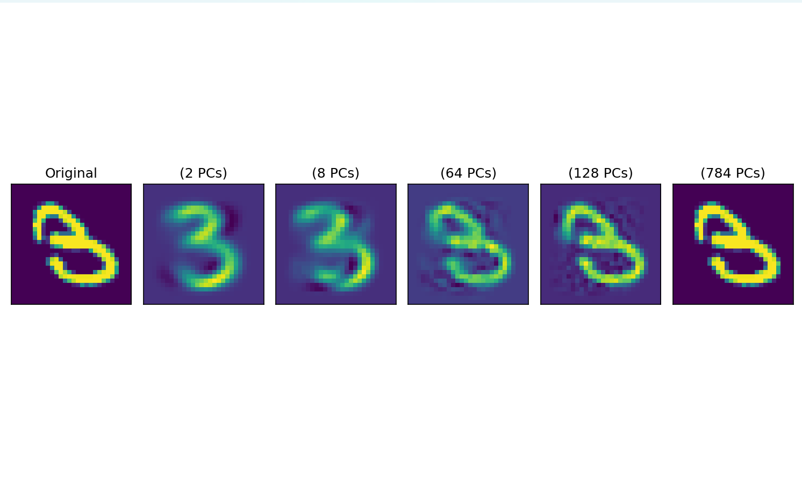
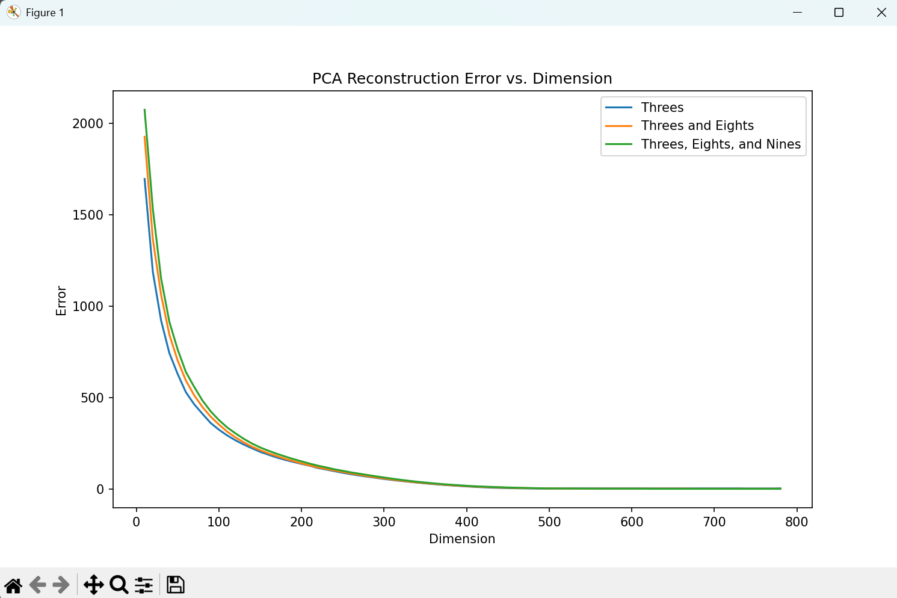

Here are the results for the single image reconstruction.

As you can see, increasing the number of principle components leads to a reconstruction more similar to the original image.

This makes sense, as less principle components means we are discarding more eigenvalues. So when we reconstruct with the sliced matrix, the image will be less similar to the original.

However, it is interesting to see that only 2 principle components are needed to get an image that somewhat resembles a three. This is because it captures the most important features that make a three look like a three. 

Also, the reconstruction with 784 principle components is nearly identical to the original image. This makes sense, as we are losing the least amount of information. 

The results for the reconstruction with larger datasets are shown above.

Here is the process I took the get the results: I computed the PCA matrix using each training set. Then, I used these components to project the test set, then reconstructing the test set. Since this test set was populated with all threes, the error represents how well the principle components of the training set describes the average image of a three.

There are three plots, one for each dataset. They all have a similar shape, which resembles an exponential decay graph. 
This makes sense, as with each additional principle component, the feature captured is less important to describing the dataset. 

I was not suprised to see that when datasets were polluted with eights and nines, the error was higher. This is because the principle components aren't able to capture soley the unique features of threes. Instead, these components are a combination of the unique features of threes, eights, and nines. 
